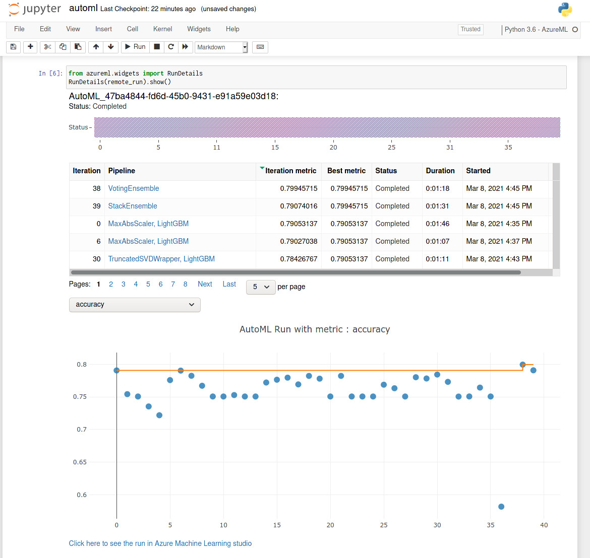
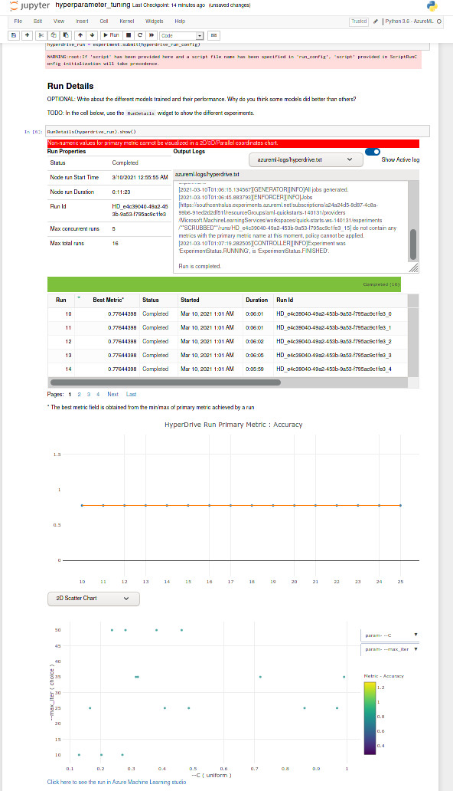
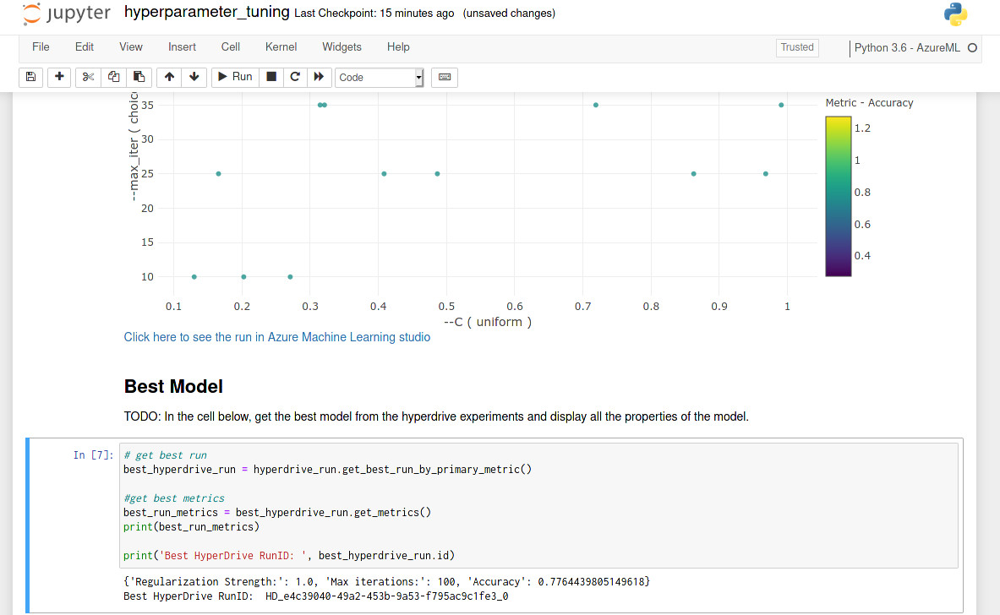

# Employee Retention Model Pipeline
This project is the creation of a pipeline and accompanying API for a model designed to assess the retention level of new employees, based on experience and demographic characteristics of said employee.

## Dataset
This dataset is from the Kaggle [HR Analytics: Job Change of Data Scientists](https://www.kaggle.com/arashnic/hr-analytics-job-change-of-data-scientists). It consists if records on employees demographics & experience, as well as their company retention.

### Task
The dataset will be used to build a ML pipeline and accompanying API for assessing new employees and their likely retention levels.

### Access
The dataset was uploaded to Azure's dataset repository, and is accessed through that for the AutoML process. It is accessed through this Github repo for the HyperDrive process.

## Automated ML
An AutoML run was conducted for this model, consisting of a classification, metriced against model accuracy.

### Results

The best model was the Voting Ensemble model, with an accuracy of 0.799. Interestingly enough this seems to often be the best model type to use.

## Hyperparameter Tuning
HyperDrive was used on a logistic regression model, tuning the L1, L2, and max iteration inputs, and targeting accuracy.

### Results

The resulting models from the Hyperparameter tuning ended up with identical accuracy values. As unusual as this is, I believe it can be explained with a regularization value that is too high. Increasing the `C` parameter should help this (since it is inverse of the regularization parameter). I decided against this however, as AutoML produced a superior model.

## Model Deployment
The model is deployed with a REST endpoint, needing proper authentication, and can be called with the 'ExperimentName' parameter in a `POST` request set to `ds_header_retention`.
[!endpoint](./images/EndpointSuccess.jpg)

## Screen Recording
Screencast video: [https://www.youtube.com/watch?v=OdYLE9z6RGg](https://www.youtube.com/watch?v=OdYLE9z6RGg).
